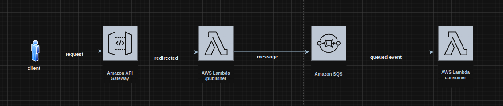
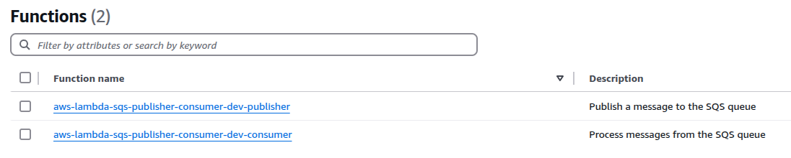
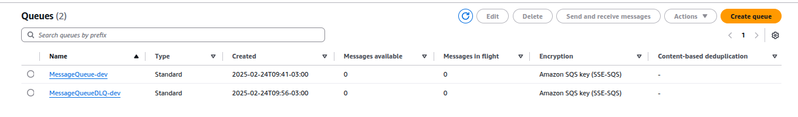

<h1 align="center">
  <br/>
  
  AWS Lambda SQS Publisher Consumer
</h1>

<p align="center">
  

  
  
  <a href="https://github.com/LucasPereiraMiranda/aws-lambda-sqs-publisher-consumer/commits/main">
    
  </a>

  <a href="https://github.com/LucasPereiraMiranda/aws-lambda-sqs-publisher-consumer/issues">
    
  </a>

  <a href="https://github.com/LucasPereiraMiranda/aws-lambda-sqs-publisher-consumer/issues">
    
  </a>
</p>

<br>


## 🚀 Techs

AWS Lambda SQS Publisher Consumer was developed with these technologies:

- [Node.js](https://nodejs.org/)
- [NPM](https://www.npmjs.com/)
- [AWS SQS](https://aws.amazon.com/sqs/)
- [AWS Lambda](https://aws.amazon.com/lambda/)
- [TypeScript](https://www.typescriptlang.org/)
- [Serverless Framework](https://www.serverless.com/)

## 💻 Project

This project is a serverless application built with AWS Lambda and SQS to demonstrate a simple publisher-consumer architecture. The publisher sends messages to an SQS queue, and the consumer processes the messages from the queue. It showcases how to implement scalable and decoupled systems using AWS services.

To ensure resilience, a Dead Letter Queue (DLQ) is used to capture and manage failed message deliveries, providing better error handling and recovery.

The solution is implemented using the Serverless Framework for easy deployment and management of resources in the cloud. The goal is study best practices in serverless architecture, messaging systems, asynchronous processing, and robust error management.

Architecture preview:



## 💻 Functions and Queue Preview

Here are some previews of the functions and queues in the project:



This image shows an overview of the functions in the AWS Lambda publisher-consumer architecture.



This image illustrates the SQS queues setup, including the dead letter queue for enhanced resilience.


## :boom: Installation

Follow these steps to set up the project with the Serverless Framework:

```bash
# Clone this repo
$ git clone git@github.com:LucasPereiraMiranda/aws-lambda-sqs-publisher-consumer.git

# Navigate to the project directory
$ cd aws-lambda-sqs-publisher-consumer

# Use Node 22 with .nvmrc reference
$ nvm use

# Install dependencies
$ npm install

# Install Serverless Framework globally
$ npm install -g serverless

# Deploy the serverless services to AWS after define your credentials with aws cli
$ serverless deploy

```

## License

[MIT](LICENSE)